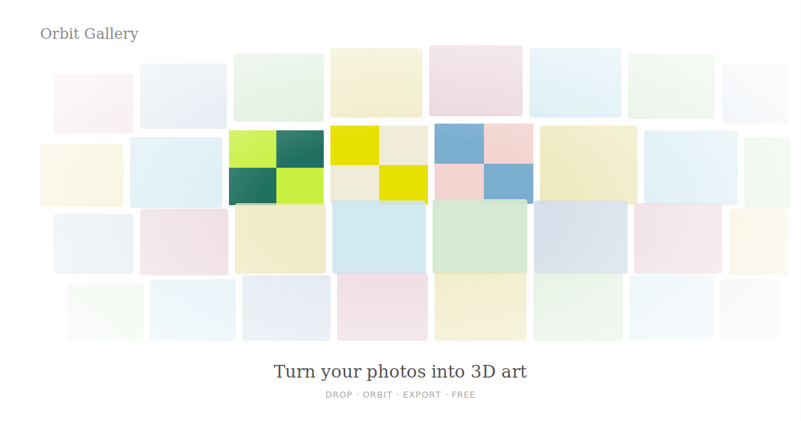

# Orbit Gallery

**Turn your photos into a rotating 3D gallery — right in your browser.**



→ **[orbit-gallery.github.io](https://your-username.github.io/orbit-gallery/)** *(update after deploy)*

---

## What it does

Drop any photos and watch them arrange onto a 3D shape that rotates and responds to your touch. No account. No server. Nothing leaves your browser.

**Shapes**
| | |
|---|---|
| ⌀ Drum | Photos wrap around a rotating cylinder |
| ◕ Sphere | Golden-ratio spiral distribution |
| ◯ Ring | Torus surface distribution |
| ∿ Coil | Continuous 3-turn helix |
| ⊟ Grid | Flat responsive photo wall |

**Controls**
- Drag to orbit freely — horizontal and vertical
- Pinch to zoom (touch) · Scroll wheel to zoom (mouse)
- Hover any photo to lift it toward you
- Click any photo to fullscreen it

**Keyboard shortcuts**
```
1 – 5   Switch shapes
Space   Pause / resume
C       Toggle controls panel
Esc     Close overlay / panel
D       Load demo tiles
```

**Export**
- Screenshot → downloads PNG
- Record 5s → downloads WebM video

---

## Deploy in 2 minutes

### GitHub Pages (free, permanent URL)

1. Fork this repo
2. Go to **Settings → Pages → Source → Deploy from branch → main → / (root)**
3. Your app is live at `https://your-username.github.io/orbit-gallery/`

### Netlify Drop (no account needed)

1. Go to [app.netlify.com/drop](https://app.netlify.com/drop)
2. Drag `index.html` + `og-image.svg` onto the page
3. Get a live URL instantly

### Local

```bash
# No build step needed — just open it
open index.html
```

---

## Files

```
orbit-gallery/
├── index.html      # The entire app — self-contained, ~34kb
├── og-image.svg    # Social preview image (1200×630)
└── README.md
```

---

## Tech

- [Three.js r128](https://threejs.org/) — 3D rendering
- [DM Sans + Instrument Serif](https://fonts.google.com/) — typography
- Vanilla JS — no framework, no build step

---

## Credits

Built by [Akshat Agarwal](https://x.com/art_akshat) using [Claude](https://claude.ai)
